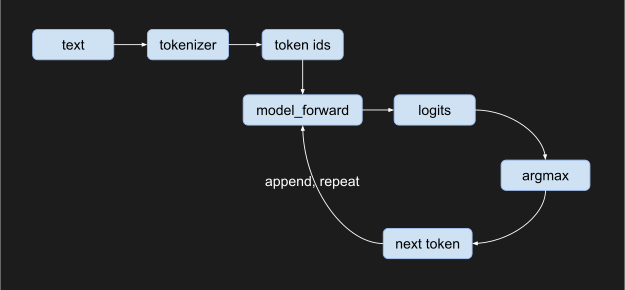
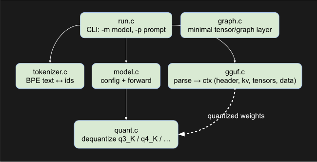
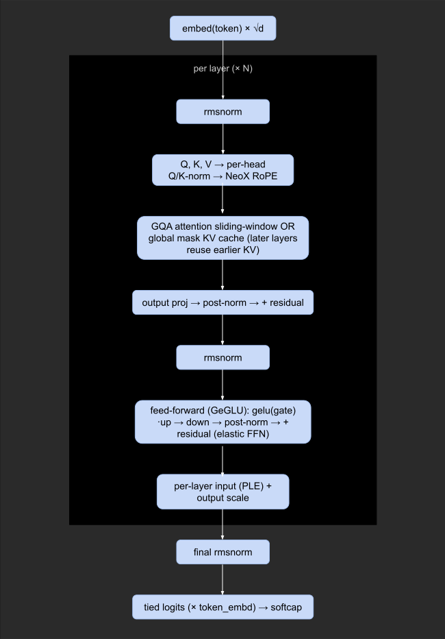

# Little Gemma

A small, from-scratch C program that loads a model stored in **GGUF** and runs it —
written to *teach* how a modern LLM actually executes, in the spirit of Karpathy's
`llama2.c` but covering a current model (Gemma) and aimed at **CUDA**.

It is a complete pipeline: parse GGUF → BPE tokenize → run the transformer →
generate text. Every stage was validated bit-for-bit against `llama.cpp`.



## Architecture



**Layering:** GGUF/ggml jargon stays in the lower layers (`gguf.c`, `quant.c`);
the model layer (`model.c`) reads like plain transformer code. The file is read
fully into RAM (no mmap — it errors out rather than silently paging), weights stay
quantized there, and each weight row is unpacked to f32 on the fly during matmul.

### What `model_forward` computes (Gemma 4 / E2B)



## How to Build

```
cmake -S . -B build
cmake --build build
```

### Release build (recommended — ~3.4× faster than Debug)

```
cmake --build build --config Release
```

Threading is via OpenMP (auto-detected by CMake); the matmul scales across cores.

### CUDA build (optional)

If the CUDA toolkit is found, CMake also builds a `run-cuda` target:

```
cmake --build build --config Release --target run-cuda
```

Same CLI as `run`. The CPU backend (`model-cpu.c`) and the CUDA backend
(`model-cuda.cu`) implement the same `model.h`; only the compute kernels differ.

## Usage

The CLI is just two flags:

```
run -m <model.gguf> [-p "prompt"]
```

- `-m` only → prints the GGUF dump + config, then exits.
- `-m` + `-p` → also tokenizes the prompt, generates, and reports tok/s.

```
> run -m model.gguf -p "The capital of France is"
The capital of France is Paris.
prompt: 6 tokens in 4.68s (1.28 tok/s)
gen:    2 tokens in 1.48s (1.35 tok/s)
```

## On SIMD (AVX2) — intentionally not implemented

The CPU matmul is plain scalar C parallelized with OpenMP; there are **no hand-written
AVX2/FMA intrinsics**. This is deliberate. Hand-vectorizing the CPU kernels would
be throwaway work, because the real target is **CUDA**: on the GPU the parallelism
comes from thousands of threads (replacing OpenMP) and the per-element math runs in
kernels (replacing what SIMD would do). The weights are already stored quantized
and unpacked inside the matmul — exactly the shape a GPU kernel wants — so the
CPU kernels in `model-cpu.c` (`matmul_q`, `rmsnorm`, `rope_neox`, `softmax`, `gelu`)
double as the reference spec for the CUDA versions in `model-cuda.cu`.

The CUDA backend is in progress. Milestone 1 (the matmul on the GPU, everything
else still on the host) already runs the E2B model at **~8 tok/s vs ~1.3 on the
CPU backend — about 6× — with a deliberately naive kernel**, so there is a lot of
headroom (keep activations resident on the device, coalesce, fuse the dequant).

## Performance vs llama.cpp (CPU, apples-to-apples)

Both **no CUDA, no SIMD intrinsics, 12 threads**, single-token generation:

| build                                         | generation |
|-----------------------------------------------|-----------:|
| little-gemma (scalar + OpenMP)                | ~1.3 tok/s |
| llama.cpp (SIMD off, CUDA off, `llama-bench`) | 2.33 tok/s |

Only **~1.8×** apart. The gap is *algorithm*, not SIMD: llama.cpp quantizes the
activation to int8 once and does an integer `vec_dot` against the quantized
weights (never materializing f32), plus better cache blocking. little-gemma
dequantizes each weight row to f32 then does an f32 dot. With AVX2 *on*,
llama.cpp reaches ~10–30 tok/s on the same machine — that headroom is what CUDA
is for.

## Lines of Code

| directory | files | code  | comment | blank | total |
|-----------|-------|-------|---------|-------|-------|
| src       | 8     | 1,951 | 147     | 277   | 2,375 |
| include   | 5     | 209   | 84      | 57    | 350   |

## Validation

Built against a CPU `llama.cpp` as an oracle (`llama-eval-callback` dumps every
intermediate tensor): dequantization is bit-exact vs the `gguf` Python package;
the forward pass matches an independent NumPy f32 reference and llama.cpp's logits
(within the f32-vs-quantized-matmul gap); the tokenizer matches `llama-tokenize`
exactly. `test/graph_test.c` (a CTest target) checks the graph kernels.

## License

MIT — see [LICENSE](LICENSE).
